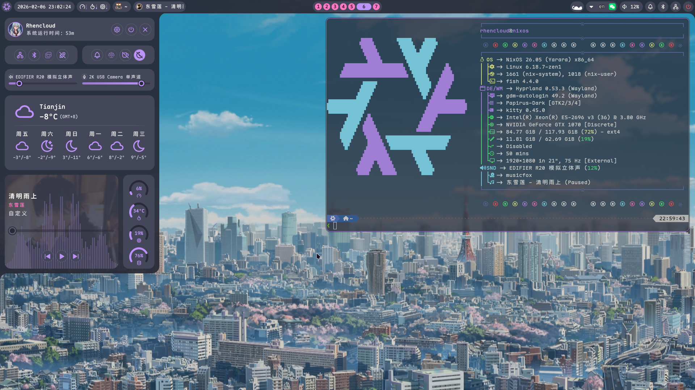

# RhenCloud 的 NixOS 配置

[](https://github.com/RhenCloud/NixOS-Config/actions/workflows/mirror.yml)
[](https://github.com/RhenCloud/NixOS-Config/actions/workflows/build.yml)
[](https://github.com/RhenCloud/NixOS-Config/actions/workflows/deploy.yml)

## 镜像仓库

本仓库同时托管于以下平台，内容保持同步：

| 平台 | 链接 |
|------|------|
| **GitHub** | https://github.com/RhenCloud/NixOS-Config |
| **GitLab** | https://gitlab.com/RhenCloud/NixOS-Config |
| **Codeberg** | https://codeberg.org/RhenCloud/NixOS-Config |
| **cnb.cool** | https://cnb.cool/RhenCloud/NixOS-Config |

## 介绍

| 项目       | 实现                                                           |
| ---------- | -------------------------------------------------------------- |
| 启动器     | [Noctalia Shell](https://noctalia.dev)                         |
| 顶栏       | [Noctalia Shell](https://noctalia.dev)                         |
| 终端       | [Kitty](https://github.com/kovidgoyal/kitty)                   |
| 编辑器     | [VSCode](https://code.visualstudio.com/)                       |
| 字体       | [Maple Mono NF CN](https://github.com/subframe7536/Maple-font) |
| 主题       | [Dracula](https://draculatheme.com)                            |
| Shell      | [Fish](https://fishshell.com)                                  |
| 桌面环境   | [Hyprland](hypr.land)                                          |
| 输入法     | [Fcitx5](https://fcitx-im.org) · [Rime](rime.im)               |
| 音乐播放   | [go-musicfox](https://github.com/go-musicfox/go-musicfox)      |
| 截图工具   | [Flameshot](https://flameshot.org/)                            |
| 剪贴板     | [Clipse](https://github.com/savedra1/clipse)                   |
| 壁纸管理器 | [Waypaper](https://github.com/anufrievroman/waypaper)          |
| 桌面歌词   | [Waylyrics](https://github.com/waylyrics/waylyrics)            |
| 浏览器     | [Zen Browser](https://zen-browser.app)                         |

## 架构

本仓库使用 [flake-parts](https://flake.parts) 组织为一个 Nix flake，所有输出由
`flake.nix` 统一声明：

```text
flake.nix
    │
    ▼
flake-parts
    │
    ├── nixosConfigurations   → systems/ 下每台主机的系统配置
    ├── homeConfigurations    → homes/ 下每位用户的主机配置
    ├── packages              → packages/ 下的自定义包
    ├── devShells             → 开发环境（default / python）
    ├── checks                → 质量检查（nix flake check 统一入口）
    ├── apps                  → build / test / switch / deploy 统一入口
    └── deploy                → deploy-rs 部署节点定义
```

顶层目录职责：

```text
systems/   → NixOS host（每主机一个目录，含 hardware-configuration.nix）
roles/     → 角色层（桌面 / 服务器能力聚合）
homes/     → Home Manager profile（<用户>@<主机> 一个目录）
modules/   → 可复用模块（nixos/ 与 home/，自动发现）
overlays/  → 包覆盖（对 nixpkgs 包的修改）
secrets/   → sops 加密的密钥
flake/     → flake 实现（各输出模块）
packages/  → 自定义包（自动发现）
```

分层关系：`host → role → module`。`systems/` 下每个主机只声明身份（hostname）、硬件、网络与存储等宿主信息，并通过一行 `rhencloud.roles.<name>.enable = true` 选择能力；`roles/<name>/default.nix` 聚合该角色所需的 `modules/` 启用；具体实现都留在可复用模块中。新增主机时大部分配置通过复用 role/module 完成。

## 主机（Hosts）

| 主机          | 类型     | 说明                     |
| ------------- | -------- | ------------------------ |
| `nixos-desktop` | 桌面     | 日常使用，Hyprland / Niri |
| `yc-hk-1`     | 服务器   | 远程部署，容器化服务     |
| `arch-server` | 服务器   | 未使用                   |

## 模块发现

模块、主机、home、包与 overlay 均通过目录约定自动发现，无需手动注册：

- **NixOS 模块**：`modules/nixos/<category>/<name>/default.nix`
- **角色**：`roles/<name>/default.nix`（定义 `rhencloud.roles.<name>.enable`，启用时聚合相关模块）
- **Home Manager 模块**：`modules/home/<category>/<name>/default.nix`
- **主机**：`systems/<arch>/<host>/`
- **home**：`homes/<arch>/<user>@<host>/`
- **自定义包**：`packages/<name>/default.nix`
- **overlay**：`overlays/<name>/default.nix`

自动发现逻辑见 `flake/helpers.nix`（`collectDefaultNix` / `discoverOverlays`）。
目录含 `disabled` 文件时该模块会被跳过。

## 构建 / 测试 / 部署

常用操作已封装为 flake apps，无需记忆复杂命令：

```bash
nix run .#build -- nixos-desktop        # 仅构建，不切换
nix run .#test -- nixos-desktop         # 测试但不创建引导项（需 root）
nix run .#switch -- nixos-desktop       # 构建并切换（需 root）
nix run .#deploy -- yc-hk-1             # 部署到远程服务器
```

等价的原生命令：

```bash
nixos-rebuild build --flake .#nixos-desktop
sudo nixos-rebuild test --flake .#nixos-desktop
sudo nixos-rebuild switch --flake .#nixos-desktop
nix run .#deploy-rs -- ".#yc-hk-1" --auto-rollback true
```

> 省略参数时默认目标：build/test/switch 为 `nixos-desktop`，deploy 为 `yc-hk-1`。

## 质量检查

```bash
# 统一质量入口：格式化 + lint + 求值 + 密钥扫描
nix flake check --all-systems
```

## CI

GitHub Actions 提供以下工作流：

| 工作流             | 触发                     | 作用                           |
| ------------------ | ------------------------ | ------------------------------ |
| `format-lint.yml`  | PR / push main           | nixfmt + statix + deadnix + gitleaks + flake check |
| `build.yml`        | PR / push main           | 构建各主机 + 推送 Cachix       |
| `build-home-manager.yml` | push main         | 构建 home activation 包        |
| `build-rime.yml`   | push main                | 构建 Rime 配置                 |
| `deploy.yml`       | build.yml 成功后         | 用 deploy-rs 部署 yc-hk-1      |
| `update-flake-lock.yml` | 定时                | 自动更新 flake.lock            |
| `mirror.yml`       | push main                | 同步镜像到 GitLab/Codeberg/cnb |

## 展示



## 管理 Secrets

本仓库使用 [sops-nix](https://github.com/Mic92/sops-nix) 管理 `secrets/` 目录下的敏感文件。
加密由 GPG 管理员密钥（编辑）与各主机 SSH host key（运行时解密）共同持有。

### 目录结构

```
secrets/
├── common.yaml                # 所有主机共享的密钥
└── hosts/
    ├── nixos-desktop.yaml     # desktop 专属密钥
    └── yc-hk-1.yaml           # 服务器专属密钥
```

### 查看 / 编辑加密文件

```bash
# 用 GPG 管理员密钥解密后编辑（sops 支持 JSON/YAML 结构编辑）
sops secrets/common.yaml
sops secrets/hosts/nixos-desktop.yaml
```

### 添加新主机

```bash
# 1) 获取主机 SSH host public key
ssh-keyscan <host>  # 或从服务器读取 /etc/ssh/ssh_host_ed25519_key.pub

# 2) 转换为 age 公钥
nix shell nixpkgs#ssh-to-age -c ssh-to-age < pubkey

# 3) 在 .sops.yaml 中为新主机添加 age recipient，然后更新已加密文件
sops updatekeys secrets/common.yaml
sops updatekeys secrets/hosts/<host>.yaml
```

### 在 Nix 模块中引用

```nix
# 声明 secret（运行时解密到 /run/secrets/<name>）
sops.secrets."sleepy-token" = {
  sopsFile = ./secrets/common.yaml;
  owner = "root";
  mode = "0400";
};

# 用模板渲染含密钥的完整配置（activation 时替换明文）
sops.templates."sleepy-env" = {
  content = "sleepy_main_secret=${config.sops.placeholder."sleepy-token"}\n";
  mode = "0400";
};
# 引用: config.sops.secrets."sleepy-token".path / config.sops.templates."sleepy-env".path
```
